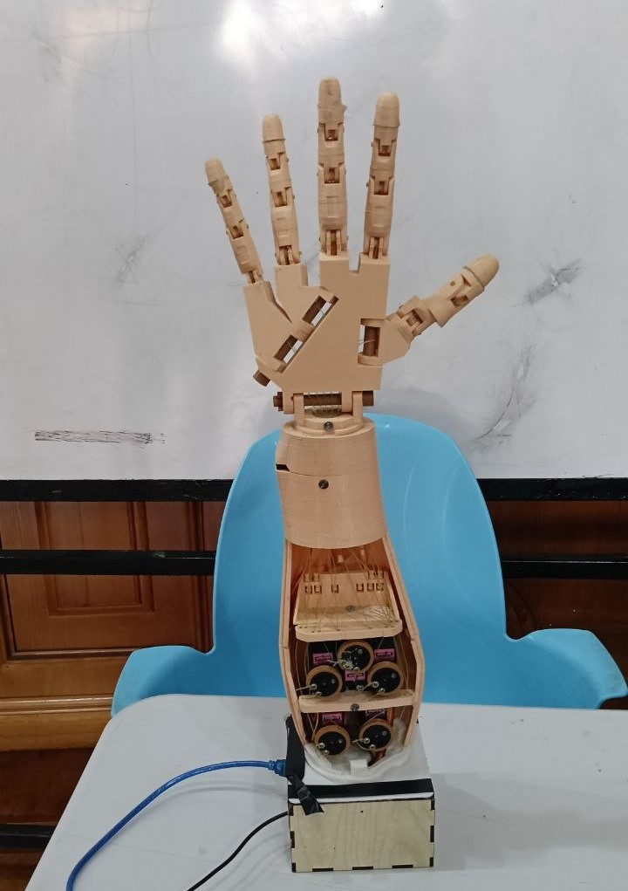

# MimicArm 🦾

**Real-time prosthetic robotic hand controlled by live camera hand tracking.**

Move your hand in front of a webcam — the robotic hand mirrors it instantly.
No buttons. No keyboard. No manual input. Just your hand.

---

## Demo

> 📹 `assets/demo.mp4`



> ⚠️ This image shows the prosthetic hand model. Real-time motion is demonstrated in the attached video.

---

## How It Works

```
Webcam  →  MediaPipe Hand Tracking  →  Python  →  Serial (USB)  →  Arduino  →  5 Servo Motors
```

1. A webcam captures your hand at ~30 FPS
2. MediaPipe detects 21 hand landmarks per frame
3. Python compares each fingertip position vs its knuckle joint to determine open/closed state
4. A 5-value array `[Thumb, Index, Middle, Ring, Pinky]` is built — `1` = open, `0` = closed
5. The array is sent over serial **only when state changes** — no spam, no lag
6. Arduino receives the values, maps each to a servo pin, and smoothly sweeps to the target angle

---

## Features

- 🎥 Fully camera-driven — zero manual input
- ⚡ Low-latency real-time tracking (~30 FPS)
- 🔄 State-change gating — serial only fires on actual changes
- 🤖 Smooth servo motion — non-blocking 4°/tick sweep
- 🛡️ Arduino buffer overflow protection — frame validation before parsing
- 🖐️ Left/right hand awareness — correct thumb detection for both
- 🖥️ Live HUD overlay — finger states + FPS + serial status
- 🖨️ Full printable 3D model included (forearm, hand, wrist)

---

## Hardware Requirements

| Component | Details |
|---|---|
| Arduino | Uno or Mega |
| Servo motors | 5× standard hobby servo (e.g. SG90 or MG996R) |
| Webcam | Any USB webcam (720p or higher recommended) |
| USB cable | Arduino to PC |
| Power supply | Separate 5V for servos (don't power from Arduino 5V pin) |
| 3D printed parts | See [`3d_model/`](#3d-model) |

### Servo Pin Mapping

| Finger | Arduino Pin |
|---|---|
| Thumb | 3 |
| Index | 5 |
| Middle | 6 |
| Ring | 9 |
| Pinky | 10 |

---

## Software Requirements

**Python 3.8+**

Install dependencies:

```bash
pip install -r requirements.txt
```

Contents of `requirements.txt`:

```
opencv-python
mediapipe
pyserial
```

**Arduino IDE 1.8+ or Arduino IDE 2.x**

Library required: `Servo` (built-in, no install needed)

---

## Getting Started

### 1. Flash the Arduino

1. Open `arduino/prosthetic_hand_controller.ino` in Arduino IDE
2. Select your board (**Tools → Board → Arduino Uno/Mega**)
3. Select your port (**Tools → Port → COMx** on Windows, `/dev/ttyUSBx` on Linux/Mac)
4. Click **Upload**

### 2. Configure the Python script

Open `python/real_time_hand_tracking.py` and set your serial port at the top:

```python
SERIAL_PORT = "COM3"   # Windows example
# SERIAL_PORT = "/dev/ttyUSB0"   # Linux/Mac example
```

> The script will also attempt to **auto-detect** your Arduino by its USB descriptor — so this is only needed as a fallback.

### 3. Run

```bash
python python/real_time_hand_tracking.py
```

A window will open showing your webcam feed with a live HUD.
Move your hand — the robotic hand will mirror it in real time.

Press `Q` to quit. All fingers will close safely on exit.

---

## Serial Protocol

Python sends a single line over serial whenever finger state changes:

```
T,I,M,R,P\n
```

Example:

```
1,1,0,0,1
```

| Value | Meaning | Servo angle |
|---|---|---|
| `1` | Finger open | 0° |
| `0` | Finger closed | 180° |

Baud rate: **115200**

---

## 3D Model

All printable parts are in `3d_model/prosthetic_hand/` organized into three subfolders.

### `forearm/`

| File | Part |
|---|---|
| `RobCableBackV3.stl` | Forearm cable channel — rear |
| `RobCableFrontV3.stl` | Forearm cable channel — front |
| `RobRingV3.stl` | Forearm ring guide |
| `RobServoBedV6.stl` | Servo mounting bed (holds all 5 servos) |
| `servo-pulleyX5.stl` | Servo pulley × 5 |
| `TensionerRightV1.stl` | Cable tensioner |

### `hand/`

| File | Part |
|---|---|
| `thumb5.stl` | Thumb finger |
| `Index3.stl` | Index finger |
| `Majeure3.stl` | Middle finger |
| `ringfinger3.stl` | Ring finger |
| `Auriculaire3.stl` | Pinky finger |
| `robpart2V4.stl` – `robpart5V4.stl` | Palm assembly parts |
| `robcap3V2.stl` | Palm cap |
| `topsurfaceUP6.stl` | Top surface plate |
| `WristlargeV4.stl` | Wrist connector — large |
| `WristsmallV4.stl` | Wrist connector — small |

### `wrist/`

| File | Part |
|---|---|
| `CableHolderWristV5.stl` | Wrist cable holder |
| `RotaWrist1V4.stl` | Rotating wrist joint — part 1 |
| `RotaWrist2V3.stl` | Rotating wrist joint — part 2 |

### Recommended Print Settings

| Setting | Value |
|---|---|
| Material | PLA or PETG |
| Layer height | 0.2 mm |
| Infill | 30–40% |
| Supports | Required for finger parts |
| Perimeters | 3+ for structural parts |

---

## Project Structure

```
MimicArm/
│
├── README.md
├── requirements.txt
├── LICENSE
│
├── arduino/
│   └── prosthetic_hand_controller.ino   # Arduino servo controller
│
├── python/
│   └── real_time_hand_tracking.py       # CV hand tracking + serial
│
├── 3d_model/
│   └── prosthetic_hand/
│       ├── forearm/                     # Servo bed, cable channels, pulleys
│       ├── hand/                        # Fingers, palm, wrist connectors
│       └── wrist/                       # Rotating wrist joint
│
└── assets/
    ├── images/
    └── demo.mp4
```

---

## Troubleshooting

**Servos move in the wrong direction**

Each servo's `ANGLE_OPEN` / `ANGLE_CLOSED` can be inverted per-finger in the Arduino file. Find the `INVERT` array at the top and set `true` for any finger that moves backwards:

```cpp
const bool INVERT[5] = {false, false, false, false, false};
//                       Thumb  Index  Mid   Ring  Pinky
```

**Serial port not found**

- Windows: Check Device Manager → Ports (COMx)
- Linux/Mac: Run `ls /dev/tty*` before and after plugging in Arduino
- Make sure no other program (e.g. Arduino IDE Serial Monitor) has the port open

**Hand not detected**

- Ensure good lighting — MediaPipe struggles in dark or backlit conditions
- Keep your hand fully within the camera frame
- Try adjusting `min_detection_confidence` in the Python script (default: 0.75)

**Lag or frame drops**

- Close other applications using the webcam
- Reduce `FRAME_W / FRAME_H` in the Python script to `640, 480`
- Ensure Arduino is on a direct USB port, not a hub

---

## License

This project is licensed under the terms in [`LICENSE`](LICENSE).

---

## Acknowledgements

- [MediaPipe](https://mediapipe.dev/) by Google — hand landmark detection
- [OpenCV](https://opencv.org/) — camera capture and display
- [Arduino Servo library](https://www.arduino.cc/reference/en/libraries/servo/) — servo control